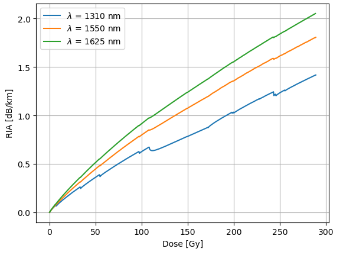

# Radiation to Photonics Project: Optical Time-Domain Reflectometry (OTDR) Data Analysis

  

## Introduction
This part of my class at University Jean-Monnet (Saint-Étienne, France) during my [Erasmus Mundus RADMEP](https://master-radmep.org) third semester last **October 2024**.

## Rayleigh Scattering and OTDR
Rayleigh scattering refers to the scattering of light by a particle whose dimension is smaller than the wavelength of light [[1](https://en.wikipedia.org/wiki/Rayleigh_scattering)]. This scattering elastic, implying that the scattered light has the _**same wavelength and intensity**_ as the incident. For optical time-domain reflectometry (OTDR), a _pulsed laser_ is injected into an _optical fiber_. The interaction of this laser with the material backscatters some of the light, and this backscattered light is measured by a detector. The schematic is shown below:

  

 <b>Figure 1.</b> OTDR measurement setup.

Under irradiation, the backscattered light does not have the same intensity as the incident but becomes _attenuated_. This phenomenon is called _**R**adiation-**I**nduced **A**ttenuation_ (RIA). This is measured using the following formula [[2](https://doi.org/10.1016/j.radmeas.2024.107246)]

$$\displaystyle  \text{RIA}(t, \lambda) = -\left(\frac{10}{L} \right) \cdot \log_{10} \left(\frac{\text{I}(t, \lambda) - \text{I}_{\text{N}}(\lambda)}{\text{I}_{\text{ref}}(0, \lambda) - \text{I}_{\text{N}}(\lambda)} \right)$$

where:

- $\text{I}(t, \lambda)$ $\rightarrow$ intensity of backscattered light at time $t$ and wavelength $\lambda$
- $\text{I}_{\text{N}}(\lambda)$ $\rightarrow$ background noise
- $\text{I}_{\text{ref}}(0, \lambda)$ $\rightarrow$ reference intensity/intensity of light at the beginning
- $L$ $\rightarrow$ length of the fiber

Below is an example curve of the measured intensity of the reflected light as a function of distance at a certain time:

  

 <b>Figure 2.</b> Image from <a href = "https://www.thefoa.org/tech/ref/testing/OTDR/OTDR.html">[3]</a>.

## Goal
The goal of this project was to plot the **RIA as a function of dose**.

## Experiment
The optical fiber was illuminated using three telecom wavelengths and the coverage windows of the OTDR curve for each are chosen as follows:

<table align = "center">
  <thead>
  <tr>
    <th align = "center">Wavelength [nm]</th>
    <th align = "center">Coverage Window [km]</th>
  </tr>
  </thead>

  <tbody>
  <tr>
    <td align = "center">1310</td>
    <td align = "center">0.06-6.39</td>
  </tr>

  <tr>
    <td align = "center">1625</td>
    <td align = "center">0.06-6.39</td>
  </tr>

  <tr>
    <td align = "center">1310</td>
    <td align = "center">0.06-4.80</td>
  </tr>
  </tbody>
</table>

<b>Table 1.</b> Telecom wavelengths and the corresponding measurement range.

At each period of time, the OTDR data for each wavelength had been measured. The optical fibers were irradiated at **105.56 µGy/s**, allowing **conversion from time to dose**.

## Data Analysis and Result
The data analysis used the following scripts:
- `ria.py` : Responsible for the data extraction and processing from raw values of the OTDR measurement
- `radiation_to_photonic_analysis.ipynb` : Jupyter notebook containing the analysis to yield the **RIA vs. dose plots** for the three telecom wavelengths.

The result of these analyses is shown in the plot below:

  

  <b>Figure 3.</b> RIA vs. dose plot for the three telecom wavelengths.

## References

**[1]**  [https://en.wikipedia.org/wiki/Rayleigh_scattering](https://en.wikipedia.org/wiki/Rayleigh_scattering).

**[2]**  A. Hasan, Y. Aguiar, R. García Alía, C. Campanella, A. Morana, A.K. Alem, S. Girard, A. Raj Mandal, M. Ferrari, "Online and offline Radiation-Induced Attenuation measurements on FD-7 radiophotoluminescence dosimeters irradiated at high X-ray doses," _Radiation Measurements_, vol. 177, 2024. [Online]. Available: [https://doi.org/10.1016/j.radmeas.2024.107246](https://doi.org/10.1016/j.radmeas.2024.107246).

**[3]**  [https://www.thefoa.org/tech/ref/testing/OTDR/OTDR.html](https://www.thefoa.org/tech/ref/testing/OTDR/OTDR.html).
